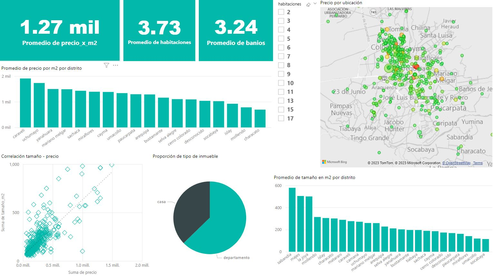

<!-- Improved compatibility of back to top link: See: https://github.com/othneildrew/Best-README-Template/pull/73 -->

<!--
*** Thanks for checking out the Best-README-Template. If you have a suggestion
*** that would make this better, please fork the repo and create a pull request
*** or simply open an issue with the tag "enhancement".
*** Don't forget to give the project a star!
*** Thanks again! Now go create something AMAZING! :D
-->

<!-- PROJECT SHIELDS -->
<!--
*** I'm using markdown "reference style" links for readability.
*** Reference links are enclosed in brackets [ ] instead of parentheses ( ).
*** See the bottom of this document for the declaration of the reference variables
*** for contributors-url, forks-url, etc. This is an optional, concise syntax you may use.
*** https://www.markdownguide.org/basic-syntax/#reference-style-links
-->

[![LinkedIn][linkedin-shield]][linkedin-url]

<h1 align="center">Housing Arequipa 2023</h1>
<h3 align="center">Web Scraping - Data Engineering - Data Analytics - Machine Leaning</h3>

  

    Después de graduarme como Data Scientist, el hábito de aprender nuevas habilidades y practicar las que ya poseo se me quedó pegado, al punto de encontrarme a mí mismo pasando horas y horas dedicado en un proyecto antes de abrir algún videojuego. En uno de mis últimos proyectos por diversión quise afinar mis habilidades para el Machine Learning, siguiendo la brillante guía de Aurélien Geron. Para explicar modelos de regresión, juega con un set de datos de precios de viviendas en California, U.S.A., obteniendo predicciones aceptablemente precisas de los precios para estas viviendas. Esta es información muy valiosa, para un ciudadano de los Estados Unidos interesado en encontrar el mejor precio para invertir en una vivienda en California. Para mí, más allá del valor del entrenamiento, es inútil. Y así nació el proyecto. 
    "Necesito viviendas de Arequipa, Perú (es ahí donde vivo), ¿pero de dónde los saco?" 
    Con técnicas de web scrapping pude extraer cierto número de información de inmuebles en venta en mi ciudad, inmediatamente estos datos pasaron por un pipeline de limpieza y procesamiento, para luego alimentar al mismo tiempo un dashboard en Power BI para el análisis, y un modelo de regresión para la predicción de los precios de nuevos inmuebles; tocando en el proceso alguna que otra técnica de procesamiento de lenguaje natural (NLP). Si algo de esto te es de utilidad, te parece interesante o tienes feedback que ofrecer, ¡me encantaría saberlo!
     
    <li><a href="#cómo-explorar-el-proyecto">Cómo explorar el proyecto</a>
     

  

<!-- TABLE OF CONTENTS -->

  
Tabla de contenido

  <ol>
    <li>
      <a href="#sobre-el-proyecto">Sobre el proyecto</a>
      <ul>
        <li><a href="#stack">Stack</a></li>
      </ul>
    </li>
    <li><a href="#cómo-explorar-el-proyecto">Cómo explorar el proyecto</a>
    <li><a href="#dashboard">Dashboard (screenshot)</a>
    <li><a href="#contacto">Contacto</a></li>
    <li><a href="#extras">Extras</a></li>
  </ol>

<!-- ABOUT THE PROJECT -->
## Sobre el proyecto

 

Este proyecto busca desarrollar un sistema de machine learning que predice los precios de inmuebles (solo casas y departametos) en Arequipa, Perú.
Los datos fueron extraídos de páginas de venta de inmuebles, y se agregaron valores calculados.
También existe un Dashboard iinteractivo (Reporte.pbix) construido en PowerBI para la analítica del mercado y los precios a la fecha.

(<a href="#readme-top">back to top</a>)

### Stack

* [Python]
* [Scrapy]
* [ScrapeOps]
* [Numpy]
* [Pandas]
* [Scikit-learn]
* [PowerBI]

<!-- GETTING STARTED -->
## Cómo explorar el proyecto

**bookscraper:** Carpeta que contiene los scrips y spiders y pipelines de procesamiento y limpieza de datos de scrapy para extraer los datos de inmuebles en venta en portales web. Contiene también los archivos .json resultantes de la extracción, tanto para casas como para departamentos (casasdata.json y depasdata.json) 

**Reporte.pbix:** Archivo de PowerBI que contiene el dashboard interactivo de análisis de los datos extraídos.   

**propiedades.csv:** Archivo .csv con los datos concatenados de todos los inmuebles (casas y departamentos) 

**Housing Arequipa EDA.ipynb:** Jupyter Notebook con el análisis exploratorio, limpiesa y preparación de los datos para en análisis y modelado.  

**HA_Model.ipynb:** Jupyter Notebook que contiene el modelado de machine learning, la iteración entre diferentes propuestas de modelo y su evaluación.  

<!-- ROADMAP -->
## Dashboard (screenshot)

 

<!-- CONTACT -->
## Contacto

Jesús Chávez      [![LinkedIn][linkedin-shield]][linkedin-url]  

jesuschavez612@gmail.com

(<a href="#readme-top">back to top</a>)

<!-- ACKNOWLEDGMENTS -->
## Extras

* Iré actualizando el modelo y poniendo a prueba propuestas más complejas para evaluar su rendimiento en comparación  
*  Idealmente, encontrar la forma de mejorar el tamaño de la muestra de datos para entrenar el modelo  

(<a href="#readme-top">back to top</a>)

<!-- MARKDOWN LINKS & IMAGES -->
<!-- https://www.markdownguide.org/basic-syntax/#reference-style-links -->
[contributors-shield]: https://img.shields.io/github/contributors/github_username/repo_name.svg?style=for-the-badge
[contributors-url]: https://github.com/github_username/repo_name/graphs/contributors
[forks-shield]: https://img.shields.io/github/forks/github_username/repo_name.svg?style=for-the-badge
[forks-url]: https://github.com/github_username/repo_name/network/members
[stars-shield]: https://img.shields.io/github/stars/github_username/repo_name.svg?style=for-the-badge
[stars-url]: https://github.com/github_username/repo_name/stargazers
[issues-shield]: https://img.shields.io/github/issues/github_username/repo_name.svg?style=for-the-badge
[issues-url]: https://github.com/github_username/repo_name/issues
[license-shield]: https://img.shields.io/github/license/github_username/repo_name.svg?style=for-the-badge
[license-url]: https://github.com/github_username/repo_name/blob/master/LICENSE.txt
[linkedin-shield]: https://img.shields.io/badge/-LinkedIn-black.svg?style=for-the-badge&logo=linkedin&colorB=555
[linkedin-url]: https://www.linkedin.com/in/jes%C3%BAs-ch%C3%A1vez-52a315230/
[product-screenshot]: images/screenshot.png

[Python]: https://www.python.org/
[Scrapy]: https://scrapy.org/
[ScrapeOps]: https://scrapeops.io/
[Pandas]: https://pandas.pydata.org/
[Numpy]: https://numpy.org/
[PowerBI]: https://powerbi.microsoft.com/
[Scikit-learn]: https://scikit-learn.org/stable/

<!--
[Vue-url]: https://vuejs.org/
[Angular.io]: https://img.shields.io/badge/Angular-DD0031?style=for-the-badge&logo=angular&logoColor=white
[Angular-url]: https://angular.io/
[Svelte.dev]: https://img.shields.io/badge/Svelte-4A4A55?style=for-the-badge&logo=svelte&logoColor=FF3E00
[Svelte-url]: https://svelte.dev/
[Laravel.com]: https://img.shields.io/badge/Laravel-FF2D20?style=for-the-badge&logo=laravel&logoColor=white
[Laravel-url]: https://laravel.com
[Bootstrap.com]: https://img.shields.io/badge/Bootstrap-563D7C?style=for-the-badge&logo=bootstrap&logoColor=white
[Bootstrap-url]: https://getbootstrap.com
[JQuery.com]: https://img.shields.io/badge/jQuery-0769AD?style=for-the-badge&logo=jquery&logoColor=white
[JQuery-url]: https://jquery.com 
